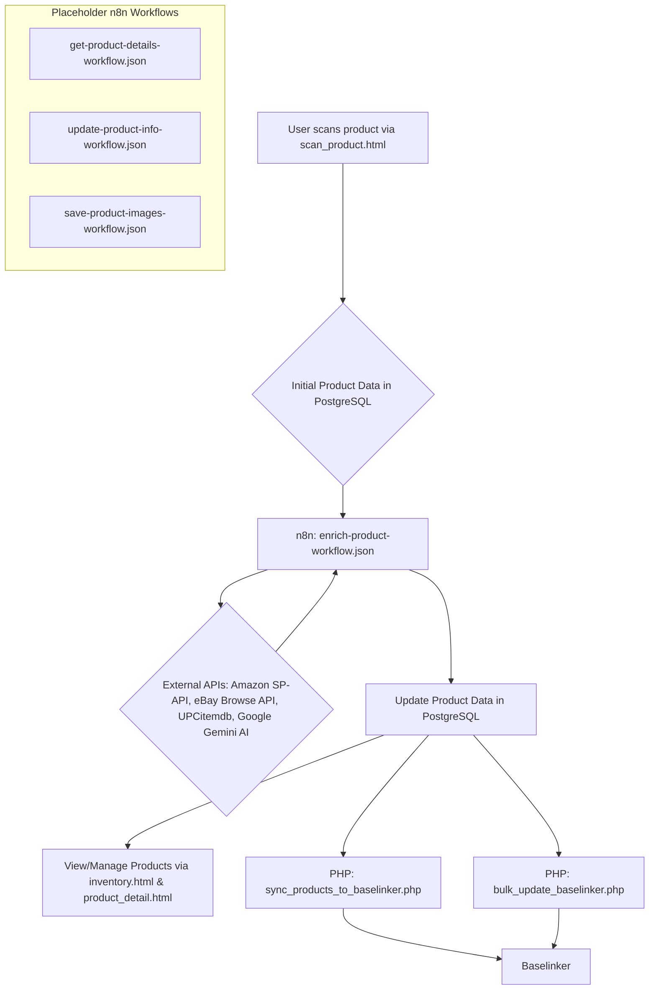
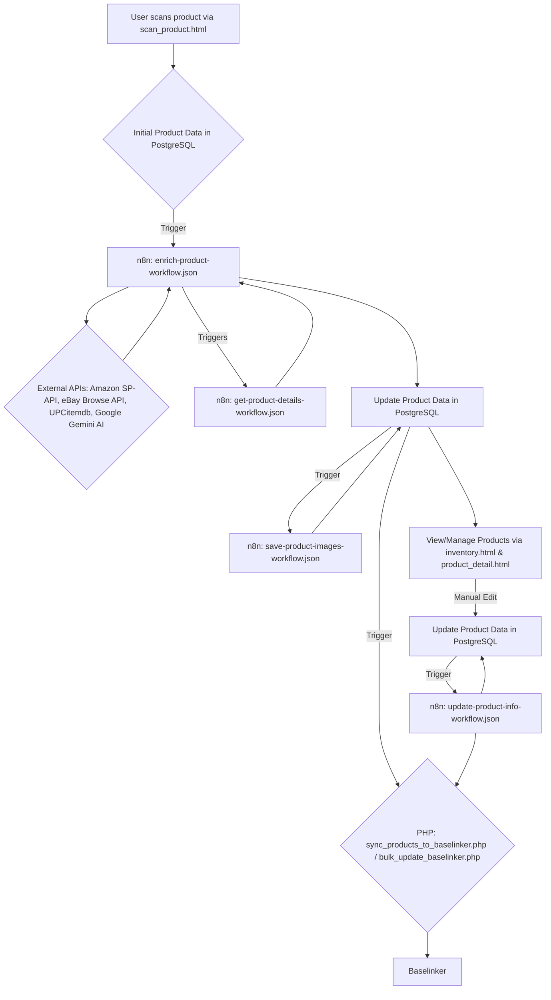

# Product Scanning, Enrichment, and Synchronization Workflow Plan

This document synthesizes the current product scanning, enrichment, and synchronization workflow, identifies areas for improvement, and proposes a refined workflow with clear reasoning.

## 1. Current Product Scanning, Enrichment, and Synchronization Workflow

The current workflow involves a mix of manual initiation, automated enrichment, and scheduled synchronization.

*   **Product Scanning (Frontend):**
    *   The process likely begins with a user interacting with [`scan_product.html`](scan_product.html) to scan a product (e.g., via UPC/EAN). This action presumably triggers a backend process to record the initial product data in a PostgreSQL database.

*   **Product Enrichment (Backend/n8n):**
    *   Once a product is initially recorded, the [`n8n_workflows/enrich-product-workflow.json`](n8n_workflows/enrich-product-workflow.json) is responsible for enriching this data. This workflow pulls product information from various external APIs: Amazon SP-API, eBay Browse API, UPCitemdb, and Google Gemini AI.
    *   After enrichment, the workflow updates the product's data in the PostgreSQL database.
    *   The [`inventory.html`](inventory.html) page likely serves as an interface for users to view and potentially manually interact with product data, possibly triggering or reviewing enrichment.
    *   [`product_detail.html`](product_detail.html) displays detailed information for individual products, which would include the enriched data.

*   **Product Synchronization (Backend PHP):**
    *   Synchronization with Baselinker is handled by PHP scripts.
    *   [`sync_products_to_baselinker.php`](sync_products_to_baselinker.php) is the primary script for pushing new products and updating existing ones from PostgreSQL to Baselinker. This suggests a scheduled or triggered synchronization process.
    *   [`bulk_update_baselinker.php`](bulk_update_baselinker.php) performs bulk updates or creations in Baselinker, likely for products that have been recently modified or newly added. This could be a more efficient way to handle larger batches of updates.
    *   [`test_baselinker_product.php`](test_baselinker_product.php) is a utility for testing Baselinker product additions, indicating that the Baselinker API integration is actively being developed or maintained.
    *   The core Baselinker API interaction is managed by [`baselinker_api/src/Api/Client.php`](baselinker_api/src/Api/Client.php) and [`baselinker_api/src/Api/Request/ProductCatalog.php`](baselinker_api/src/Api/Request/ProductCatalog.php).
    *   Helper functions in [`includes/helpers.php`](includes/helpers.php) support various tasks, including image validation and eBay category mapping, which are relevant to product data preparation for Baselinker.

*   **Placeholder n8n Workflows:**
    *   [`n8n_workflows/get-product-details-workflow.json`](n8n_workflows/get-product-details-workflow.json), [`n8n_workflows/update-product-info-workflow.json`](n8n_workflows/update-product-info-workflow.json), and [`n8n_workflows/save-product-images-workflow.json`](n8n_workflows/save-product-images-workflow.json) are currently placeholders, suggesting future automation or integration points.

Here's a high-level Mermaid diagram of the current workflow:

## 2. Areas for Improvement

Based on the synthesis, here are some potential areas for improvement:

*   **Manual Triggers/Lack of Automation:** The initial scan triggers data entry, but the subsequent enrichment and synchronization might not be fully automated or seamlessly integrated. It's unclear how `enrich-product-workflow.json` is triggered after a scan.
*   **Incomplete n8n Workflows:** The presence of placeholder n8n workflows indicates missing automation for critical steps like retrieving product details, updating information, and saving images.
*   **Data Consistency and Real-time Updates:** The current setup might lead to delays between product scanning, enrichment, and synchronization, potentially causing data inconsistencies in Baselinker if updates aren't immediate or properly queued.
*   **User Experience:** The flow from scanning to viewing enriched data and ensuring it's synchronized could be more streamlined for the user. Manual intervention for enrichment or synchronization might be required.
*   **Error Handling and Notifications:** The summaries don't detail error handling mechanisms for API calls or synchronization failures.
*   **Redundancy in Synchronization:** While `sync_products_to_baselinker.php` and `bulk_update_baselinker.php` serve different purposes (individual vs. bulk), their interaction and trigger mechanisms could be optimized to avoid redundant calls or missed updates.
*   **Image Management:** The `save-product-images-workflow.json` is a placeholder, suggesting that image handling (downloading, storing, associating with products) is not fully automated or integrated.

## 3. Proposed Refined Workflow

The refined workflow aims to automate the entire process from scanning to Baselinker synchronization, leveraging the placeholder n8n workflows and ensuring better data consistency and user experience.

**Key Improvements:**

1.  **Automated Enrichment Trigger:** After a product is scanned and initially saved, automatically trigger the `enrich-product-workflow.json`.
2.  **Integrated Product Details Retrieval:** Utilize `get-product-details-workflow.json` to fetch additional details as part of the enrichment or post-enrichment process.
3.  **Automated Image Saving:** Integrate `save-product-images-workflow.json` to automatically download and associate images with products after enrichment.
4.  **Streamlined Product Information Updates:** Use `update-product-info-workflow.json` for any subsequent updates to product information, potentially triggered by manual edits on `product_detail.html` or further enrichment.
5.  **Event-Driven Synchronization:** Implement a mechanism to trigger Baselinker synchronization (either `sync_products_to_baselinker.php` or `bulk_update_baselinker.php`) immediately after a product is successfully enriched and updated in PostgreSQL, rather than relying solely on scheduled tasks. This could be achieved via webhooks from n8n or database triggers.

**Step-by-Step Refined Workflow:**

1.  **User Scans Product:**
    *   User interacts with [`scan_product.html`](scan_product.html) to scan a product (e.g., UPC/EAN).
    *   Initial product data is saved to PostgreSQL.

2.  **Automated Enrichment & Detail Retrieval:**
    *   Upon successful initial save, a webhook or database trigger automatically initiates [`n8n_workflows/enrich-product-workflow.json`](n8n_workflows/enrich-product-workflow.json).
    *   This workflow:
        *   Fetches product details using external APIs (Amazon SP-API, eBay Browse API, UPCitemdb, Google Gemini AI).
        *   Integrates with and triggers [`n8n_workflows/get-product-details-workflow.json`](n8n_workflows/get-product-details-workflow.json) to retrieve any additional specific details.
        *   Updates the PostgreSQL database with the enriched data.

3.  **Automated Image Saving:**
    *   As part of or immediately after the enrichment process, [`n8n_workflows/save-product-images-workflow.json`](n8n_workflows/save-product-images-workflow.json) is triggered.
    *   This workflow downloads product images from external sources and saves them, associating them with the product in PostgreSQL.

4.  **Real-time Baselinker Synchronization:**
    *   Once the product data (including images) is fully enriched and updated in PostgreSQL, a trigger (e.g., n8n webhook, database trigger, or a message queue) initiates the synchronization process.
    *   This trigger calls either [`sync_products_to_baselinker.php`](sync_products_to_baselinker.php) (for individual product updates) or queues the product for `bulk_update_baselinker.php` (for batch processing).
    *   The PHP scripts interact with the Baselinker API via [`baselinker_api/src/Api/Client.php`](baselinker_api/src/Api/Client.php) and [`baselinker_api/src/Api/Request/ProductCatalog.php`](baselinker_api/src/Api/Request/ProductCatalog.php) to push/update product data.

5.  **Product Management & Further Updates:**
    *   Users can view and manage enriched products via [`inventory.html`](inventory.html) and [`product_detail.html`](product_detail.html).
    *   If manual edits are made on `product_detail.html`, these changes update PostgreSQL. A trigger then initiates [`n8n_workflows/update-product-info-workflow.json`](n8n_workflows/update-product-info-workflow.json) to handle the update logic and subsequently trigger Baselinker synchronization for the modified product.

Here's a high-level Mermaid diagram of the refined workflow:

## 4. Reasoning for Proposed Improvements

*   **Automated Enrichment Trigger (from scan):**
    *   **Benefit:** Eliminates manual steps, reduces human error, and ensures immediate enrichment after initial product capture. This speeds up the overall process and provides more complete data sooner.
*   **Integrated Product Details Retrieval (`get-product-details-workflow.json`):**
    *   **Benefit:** Centralizes and automates the fetching of all necessary product details. By integrating this placeholder, the enrichment process becomes more comprehensive and less reliant on manual data gathering.
*   **Automated Image Saving (`save-product-images-workflow.json`):**
    *   **Benefit:** Crucial for e-commerce. Automating image handling ensures products in Baselinker have associated images without manual intervention, improving product presentation and reducing workload.
*   **Streamlined Product Information Updates (`update-product-info-workflow.json`):
    *   **Benefit:** Provides a consistent and automated way to handle subsequent product updates, whether from further enrichment or manual edits. This ensures data consistency across PostgreSQL and Baselinker.
*   **Event-Driven Synchronization:**
    *   **Benefit:** Moves from potentially delayed scheduled synchronization to near real-time updates. This significantly improves data consistency between the internal database and Baselinker, ensuring that Baselinker always has the most up-to-date product information. It also reduces the window for discrepancies.
*   **Leveraging n8n for Orchestration:**
    *   **Benefit:** By fully utilizing n8n for triggers and orchestrating the various API calls and data updates, the workflow becomes more robust, easier to monitor, and scalable. n8n's visual workflow builder can also improve maintainability.
*   **Improved User Experience:**
    *   **Benefit:** The user's interaction is primarily limited to scanning and reviewing. The system handles the complex enrichment and synchronization in the background, providing a smoother and more efficient experience.